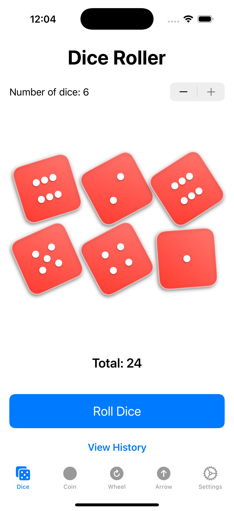
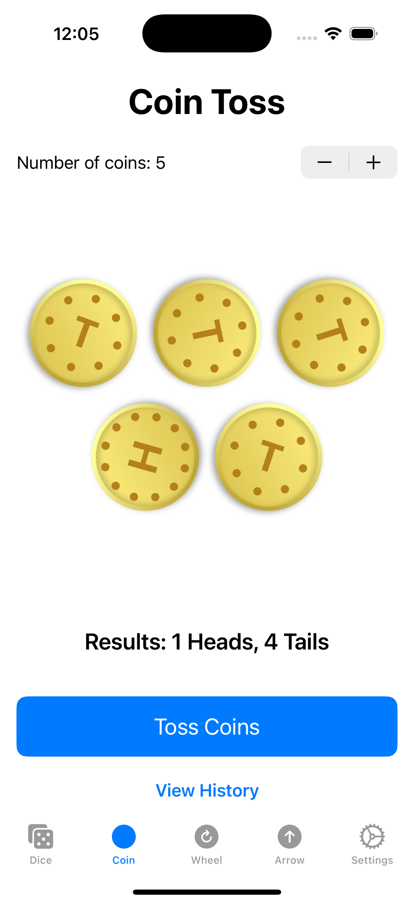
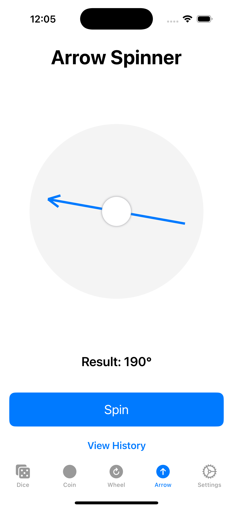

# 🎲 GameMate - Your Pocket Game Toolkit

**GameMate** is a comprehensive iOS toolkit that puts multiple useful games and randomization tools in your pocket. From rolling dice to flipping coins, spinning wheels to ladder games - all with beautiful animations and a clean interface.

---


[](LICENSE)

---

## ✨ Key Features

- **🎲 Dice Roller**  
  Roll up to 6 dice with physics-based animations and customizable colors.

- **🪙 Coin Flipper**  
  Flip customizable coins with realistic animations and physics.

- **🎡 Spin Wheel**  
  Create a customizable wheel with up to 12 sections to help make random decisions.

- **↗️ Arrow Spinner**  
  A simple random direction spinner with smooth animations.

- **🪜 Ladder Game**  
  Randomly connect players to prizes/destinations with an intuitive interface.

- **📝 History Tracking**  
  Keep track of all your game results with a comprehensive history feature.

- **🌐 Localization**  
  Full support for multiple languages including English, Spanish, French, Japanese, Korean, and Chinese.

- **⚙️ Customizable Interface**  
  Reorder and select which games appear in your tab bar.

- **🌓 Adaptive UI**  
  Automatically adapts to light and dark mode.

- **✨ Splash Screen**  
  Beautiful splash screen with app icon animation.

## 📱 Screenshots

Each game in GameMate features beautiful animations and a clean, intuitive interface:

<div align="center">
  <table>
    <tr>
      <td align="center"></td>
      <td align="center"></td>
      <td align="center"></td>
    </tr>
    <tr>
      <td align="center"></td>
      <td align="center"></td>
      <td align="center"></td>
    </tr>
  </table>
</div>

- **🎲 Dice Roller**: Physics-based animations with customizable colors
- **🪙 Coin Flipper**: Realistic 3D animations with physics effects
- **🎡 Spin Wheel**: Customizable segments for random decision making
- **↗️ Arrow Spinner**: Simple spinner with smooth rotation animations
- **🪜 Ladder Game**: Connect players to destinations with animated paths

## 🧰 Project Structure

```
GameMate/
├── Sources/
│   ├── App/             # Main app files and entry point
│   ├── Views/           # UI components
│   │   ├── Games/       # Game-specific views
│   │   └── Settings/    # Settings views
│   ├── Models/          # Data models
│   ├── Services/        # App services
│   └── Utilities/       # Extensions and helpers
└── Resources/
    ├── Assets/          # Images and colors
    ├── Localization/    # Localized strings
    └── Fonts/           # Custom fonts
```

## 🚀 Getting Started

### Requirements

- iOS 15.0+
- Xcode 14.0+
- Swift 5.7+

### Installation

1. Clone the repository
```bash
git clone https://github.com/yourusername/GameMate.git
```

2. Open `GameMate.xcodeproj` in Xcode

3. Build and run the application on your device or simulator

### Testing on Your Device

1. Connect your iPhone/iPad to your Mac
2. In Xcode, select your device from the device dropdown near the Run button
3. Set up signing:
   - Select the GameMate target
   - Go to "Signing & Capabilities" tab
   - Check "Automatically manage signing"
   - Select your Apple ID/Team
4. Click "Run" to build and run on your device

### Submitting to App Store

1. **Prepare Your App**
   - Update app icons in Assets.xcassets
   - Verify all localizations are complete
   - Test thoroughly on multiple devices

2. **Archive and Upload**
   - Select Product → Archive in Xcode
   - In the Archives window, click "Distribute App"
   - Choose "App Store Connect" and follow the prompts

3. **Complete App Store Connect Setup**
   - Log in to [App Store Connect](https://appstoreconnect.apple.com)
   - Provide app metadata, screenshots, and descriptions
   - Set up pricing and availability
   - Submit for review

## 💡 How to Use

### Dice Roller
Select the number of dice (1-6) and tap "Roll Dice" to get random results with realistic animations.

### Coin Flipper
Choose the number of coins and tap "Toss Coins" for heads or tails results with physics-based flipping animations.

### Spin Wheel
Customize wheel segments and tap "Spin" to randomly select from your options.

### Arrow Spinner
Tap "Spin" to rotate the arrow in a random direction.

### Ladder Game
Connect starting points to random destinations with animated path following.

### Customizing Your Interface
1. Go to Settings
2. In the Games tab, toggle which games you want visible
3. Drag to reorder games in your preferred order

## 🤝 Contributing

Contributions are welcome! If you'd like to improve GameMate:

1. Fork the repository
2. Create your feature branch (`git checkout -b feature/amazing-feature`)
3. Commit your changes (`git commit -m 'Add some amazing feature'`)
4. Push to the branch (`git push origin feature/amazing-feature`)
5. Open a Pull Request

## 📄 License

This project is licensed under the MIT License - see the [LICENSE](LICENSE) file for details.

The MIT license is commonly used for open-source iOS projects as it provides freedom for others to use, modify, and distribute the software while maintaining minimal restrictions.

---

Made with ❤️ using SwiftUI